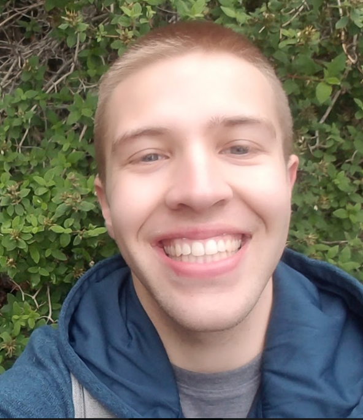
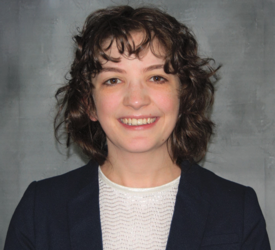
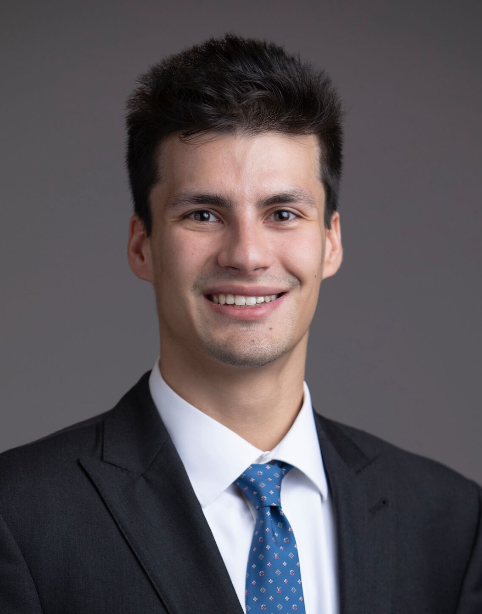
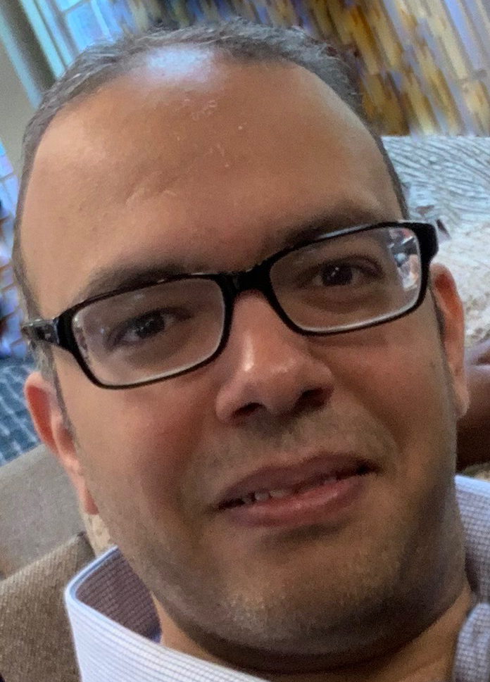
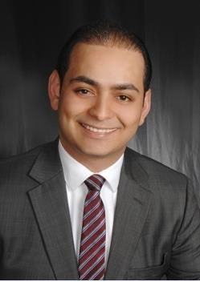
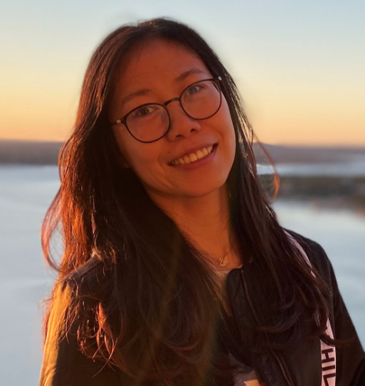

# Teaching Assistants

- To contact the TAs (and Dr. Love) at any time, email `431-help` at `case dot edu`.

The teaching assistants for 432 this year are 

- [Benjamin Booker, BS]
- [Julijana Conic, MD]
- [Joseph Hnath, BA]
- [Amr Mahran, MD MS]
- [Amin Saad, MD]
- [Jing Zhang, MD MS]

They are the people answering `431-help at case dot edu`, and they are the people holding the bulk of our regular office hours. Most of them has been in your shoes - they've taken the course in the past, and they enjoyed it enough to come back for more. Many have volunteered their precious time and energy to help make the course happen, and we couldn't be more delighted to welcome you to the course. To contact the TAs, email `431-help at case dot edu`, which is open all semester, starting on the first day we meet.

## Office Hours for TAs

- To contact the TAs (and Dr. Love) at any time, email `431-help` at `case dot edu`. This is a challenging class. Don't suffer in silence - talk to us!

Teaching Assistant Office Hours are held in either WG-56 (Computing Lab) or WG-67 (Student Lounge) on the ground floor of the Wood building in the School of Medicine, so be sure to look in both places if you need help. The weekly schedule will be posted on the bottom of the [Course Calendar](https://github.com/THOMASELOVE/2020-432/blob/master/calendar.md). 

TA office hours are not held on University holidays, or during Spring Break, although 431-help remains open until the last project is completed in May. 

This is a challenging class. Don't suffer in silence - talk to us!

## Benjamin (Ben) Booker, BS

```{r Ben_fig, echo = FALSE, out.width = '30%'}

```

Benjamin (Ben) Booker is a first year PhD student in the Epidemiology & Biostatistics program in the Department of Population & Quantitative Health Sciences. Ben holds a BS in Molecular Biology from the University of Cincinnati, and then completed two years of additional training in Biostatistics there. He has worked at Cincinnati Children's Hospital performing DNA methylation analysis, and as a data scientist consultant for Givaudan Flavors. Outside of work and school I enjoy rock climbing/bouldering (novice level), playing soccer and watching the European football leagues. 

## Julijana Conic, MD

```{r Julijana_fig, echo = FALSE, out.width = '30%'}

```

Julijana Conic was born in Serbia and received her MD from the University of Belgrade Faculty of Medicine last year. Since enrolling in the MS in Clinical Research program the same year she has been conducting research focusing on ischemic mitral regurgitation in the Department of Cardiovascular Imagining at the Cleveland Clinic. Currently, she is working on a project incorporating machine learning to improve existing algorithms for automatic quantification of cardiac volumes on MRI images and to aid in risk stratification of ischemic mitral regurgitation patients. She hopes to start internal medicine residency next year and ultimately establish herself as a physician investigator. During her free time Julijana enjoys hiking, watching movies and volunteering in the community. 

## Joseph Hnath, BA

```{r Joseph_fig, echo = FALSE, out.width = '30%'}

```

Joseph Hnath is in his second year of the Master of Public Health program on the Intensive Research Pathway with concentrations in Population Health Research and Health Policy & Management. He finished his undergraduate studies at CWRU this May where he majored in Chemical Biology, Cognitive Science, and Economics. Having taken 431 & 432 last year, the skills he learned have been invaluable in his research projects, such as his capstone on the health economics of abortion policy and helping with the NEO-CASE cancer disparities resource. Joseph enjoys playing basketball, watching Master Chef, and reading *The Complete Works of F. Scott Fitzgerald*.

## Amr Mahran, MD MS

```{r Amr_fig, echo = FALSE, out.width = '30%'}

```

Amr Mahran is a urologist who is working as a senior research associate in the department of urology, CWRU School of Medicine. He received his MD degree from Assiut University School of Medicine in Upper Egypt. He also finished a residency in urology along with earning a Master of Science degree. Before joining CWRU, Amr was a practicing urologist and was appointed as a faculty at the department of urology, Assiut University Hospitals. Amr took 432 in the spring of 2019 and learned many skills that helped him in his clinical research. Amr's research focus on prostate cancer, pelvic pain, and voiding dysfunction. He does outcome research on large databases as NSQIP, National Trauma Database (NTDB), and NIS databases. Amr enjoys playing soccer, table tennis, and reading.

## Amin Saad, MD

```{r Amin_fig, echo = FALSE, out.width = '30%'}

```

Amin Saad is an international medical graduate from Syria with two years of General Surgery residency training experience in the United States. Amin is currently enrolled in the CRSP Master's program and is seeking a Ph.D. degree in Clinical and Translational Research with a focus toward lowering surgical site infection rates. Amin took 431 and 432 two cycles ago and has appreciated how the skills he learned in those classes have helped him with his clinical outcomes research at the Department of Colorectal Surgery at University Hospitals. Amin enjoys playing soccer, swimming, and spending time with his family.

## Jing Zhang, MD MS

```{r Jing fig, echo = FALSE, out.width = '30%'}

```

Jing Zhang is a first year PhD student in the Epidemiology and Biostatistics program in the Department of Population and Quantitative Health Sciences. Jing finished her undergraduate studies in Clinical Medicine and graduate studies in Biostatistics at Fudan University, Shanghai, China. She values the statistical analysis skills learned during graduate studies and enjoys solving statistical problems. During her spare time, she likes jogging and cooking.

